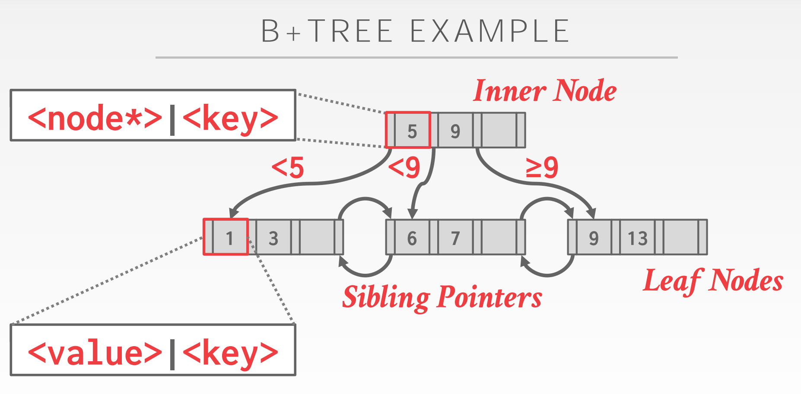
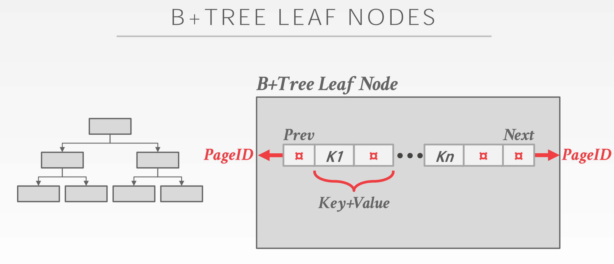
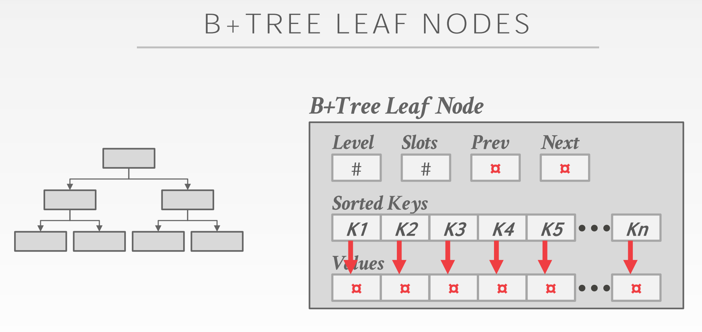
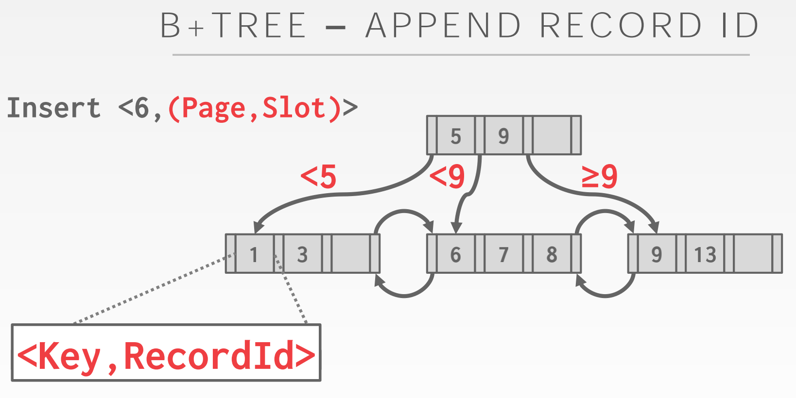
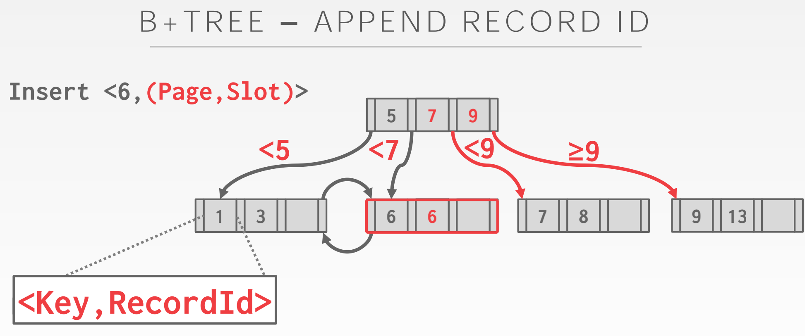
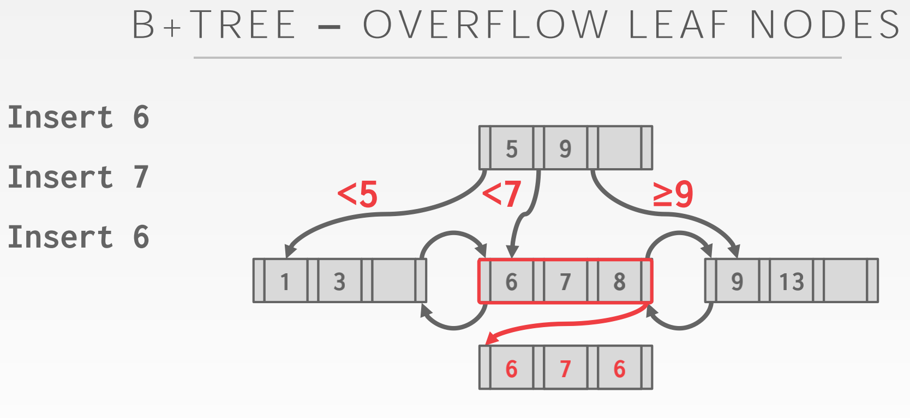

# *Lecture #07: Tree Indexes I*

## *1. Table Indexes*

索引（ `Table Index` ）：

为了有效检索，表若干属性（子集）的一个聚合或排序

* `DBMS` 使用表索引的额外数据结构来更快的找到元组
* `DBMS` 保证表内容和索引逻辑上同步
* `DBMS` 决定每个查询使用的最合适的索引

## *2. B+Tree*

### *2.1 B+Tree Properties*：

* B+ 树是 `M-way` 搜索树，拥有以下属性：
    - perfectly balanced （所有叶节点在同一层）
    - 除了根结点，所有节点至少是半满的 （`half-full`，M/2-1 <= #keys <= M-1）    
    - 所有拥有 k 个键的节点有 k + 1 个非空子节点

### *2.2 B+Tree Example*



### *2.3 Nodes*

* 每个 B+ 树节点是由键值对数组（array of key/value pairs）构成的
    - 键来源于索引`index`依赖的表属性`table attributes`
    - 根据节点被分类为内部节点`inner nodes`还是叶节点`leaf nodes`，这些值会有所不同。
    - 数组（通常）按排序键顺序保存。

### *2.4 B+Tree Leaf Nodes*





### *2.5 Leaf Node Values*

1. 记录 id
    - 指向索引项对应的元组位置的指针
2. 元组数据
    - 元组的实际内容存储在叶节点中
    - 二级索引必须将记录id存储为其值

## *3. Operation*

[在线演示](https://www.cs.usfca.edu/~galles/visualization/BPlusTree.html)

### *3.1 Insertion*

``` 

// 若要拆分内部节点，均匀地重新分配条目，但要将中键向上提。
找到正确的节点 L;
将数据条目按序放入节点 L;
if （L 有足够空间）:
    done;
else:
    分裂 L 为 L 和新节点 L2;
    均匀的重新分配数据条目，复制中间键;
    将指向 L2 的索引项插入到 L 的父项中;
```

### *3.2 Deletion*

``` 

// 如果发生合并，则必须从 L 的父项中删除项（指向 L 或同级项）。
从根开始找到数据条目所属的叶节点;
移除该数据;
if (L 至少是 half-full 的):
    done;
if (L 只有 M/2-1 个条目):
    尝试重新分发，借用同级节点（与 L 具有相同父级的相邻节点）;
    如果重新分发失败，合并 L 和兄弟;
```

## *4. Duplicate Keys*

1. 添加记录Id（*Append Record Id*）

添加元组的唯一记录id作为键的一部分，以确保所有键都是唯一的。
DBMS仍然可以使用部分键来查找元组。





2. 溢出叶节点（*Overflow Leaf Nodes*）

允许叶节点溢出到包含重复键的溢出节点
维护和修改更复杂。



## *5. Clustered  Indexes*

表按主键指定的排序顺序存储。可以是堆或索引组织的存储。
有些数据库管理系统总是使用聚集索引。如果主键不包含主键，则DBMS将自动生成一个隐藏的主键。

### *5.1 Clustered B+Tree*

遍历到最左边的叶节点对应的页，然后从所有叶页检索元组。
这总是比外部排序好。
