# *Lecture #08: Tree Indexes II*

## *1. B+Tree Design Choices*

### *1.1 Node Size*

根据存储介质的不同，我们可能会选择更大或更小的节点大小。例如，存储在硬盘上的节点的大小通常为兆字节，以减少查找数据所需的查找次数，并将昂贵的磁盘读取分摊到大量数据上，内存中的数据库可能使用小到512字节的页面大小，以便将整个页面放入CPU缓存中，并减少数据碎片。这种选择也可能取决于工作负载的类型，因为点查询（ `point queries` ）希望页面尽可能小，以减少加载的不必要的额外信息量，而大型顺序扫描可能更喜欢大页面以减少需要执行的获取次数。

* HDD ~1MB
* SSD: ~10KB 
* In-Memory: ~512B

### *1.2 Merge Threshold*

虽然B+树有一个规则，在删除后合并未流节点，但有时，临时违反规则以减少删除操作的数量可能会有好处。例如，迫切的合并可能导致混乱，大量的连续删除和插入操作导致持续的拆分和合并。它还允许批量合并，多个合并操作同时发生，减少在树上消耗的昂贵的写锁（ `write latches` ）时间。

### *1.3 Variable Length Keys*

1. 指针

    将键存储为指向元组元素的指针。
    与直接存储key不同，只需存储一个指向key的指针。
    由于必须为每个键跟踪一个指针的效率很低，因此在生产中使用这种方法的唯一地方是嵌入式设备，在这些设备中，其微型寄存器和缓存可以从节省的空间中获益

2. 可变长节点

    - 索引里每个节点的大小是可变的
    - 需要严格的内存管理
    - 由于处理可变长度节点的内存管理开销很大，因此这是不可行的，并且在很大程度上没有使用。

3. 填充

    总是将键填充至当前键类型的最大值
    我们可以将每个键的大小设置为最大键的大小，并填充所有较短的键，而不是改变键的大小。
    在大多数情况下，这是一个巨大的内存浪费，所以你也看不到任何人使用它。

4. 键值 / 间接

    在节点中嵌入映射到key+value列表的指针数组。
    几乎所有人都使用的方法是在单独的字典中用键值对的索引来替换键。
    这样可以节省大量空间，并可能为点查询提供快捷方式（因为索引指向的键值对与叶节点指向的键值对完全相同）。
    由于字典索引值太小，有足够的空间将每个键的前缀放在旁边索引，可能允许一些索引搜索和叶扫描甚至不必跟踪指针（如果前缀与搜索键完全不同）。

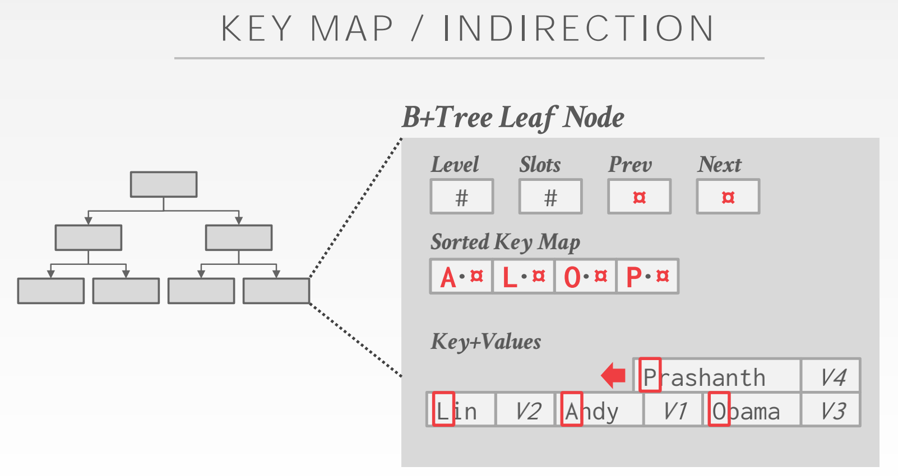

### *1.4 Intra-Node Search*

1. 线性

从头到尾扫描节点键。
最简单的解决方案是扫描节点中的每个密钥，直到找到密钥为止。一方面，我们不必担心键的排序，使插入和删除更快。另一方面，这种方法效率相对较低，每次搜索的复杂度为O（n）。

2. 二分

跳到中间键，根据比较结果左右旋转。
更有效的搜索解决方案是保持每个节点的排序，并使用二分搜索来查找密钥。这就像跳到节点中间并根据关键点之间的比较向左或向右旋转一样简单。这种方式搜索效率更高，因为这种方法每次搜索的复杂度仅为O（ln（n））。但是，插入变得更加昂贵，因为我们必须维护每个节点的排序。

3. 插值

已知密钥分布上所需的近似位置。

最后，在某些情况下，我们可以利用插值来找到关键点。这种方法利用存储在节点上的任何元数据（例如最大元素、最小元素、平均值等），并使用它生成密钥的大致位置。例如我们在一个节点中查找8，我们知道10是最大键，10 -（n+1）是最小键（其中n是每个节点中的密钥数），然后我们知道要从max键向下搜索2个槽，因为在这种情况下，距max key一个槽的键必须是9。尽管该方法是我们给出的最快的方法，但由于其对具有特定属性（如整数）和复杂性的密钥的适用性有限，因此仅在学术数据库中见到。

## *2. Optimizations*

### *2.1 Prefix Compression*

* 大多数情况下，当我们在同一个节点中有键时，每个键的某些前缀会有一些部分重叠（因为类似的键将在排序后的B+树中紧挨着结束）。
* 我们不需要多次将这个前缀作为每个密钥的一部分存储，而只需在节点的开头存储一次前缀，然后在每个槽中只包含每个密钥独特的部分。

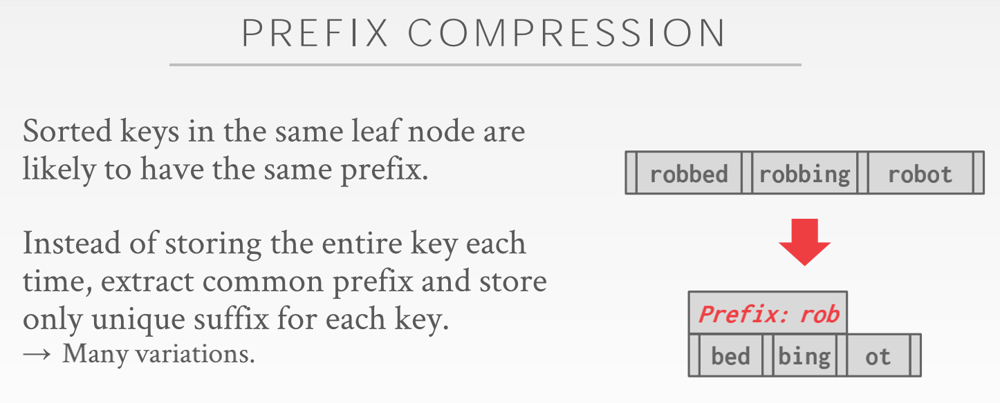

### *2.2 Deduplication*

* 在允许非唯一键的索引的情况下，可能重复遇到叶节点相同但值不同的情况。
* 键只存储一次，将值以链表的形式存储到该键下。

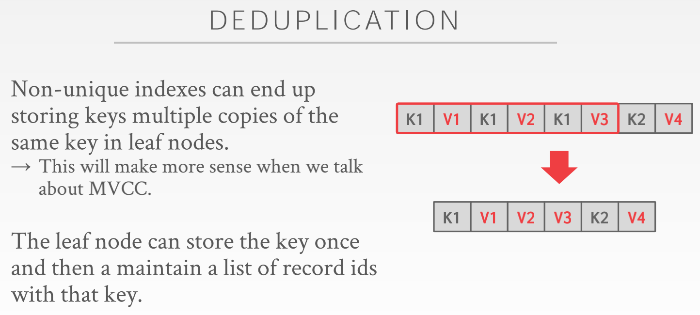

### *2.3 Suffix Truncation*

* 在大多数情况下，内部节点中的键只是用作路标，而不是它们的实际键值（即使某个键在索引中存在，我们仍然必须搜索到底部以确保它没有被删除）。
* 利用这一点，只在给定的内部节点存储每个键的最小区分前缀。虽然我们可以将其最小化为一个单独的不同字符/数字，但在末尾留下一些冗余的数字，以减少由于相同前缀而导致的不确定插入的可能性。

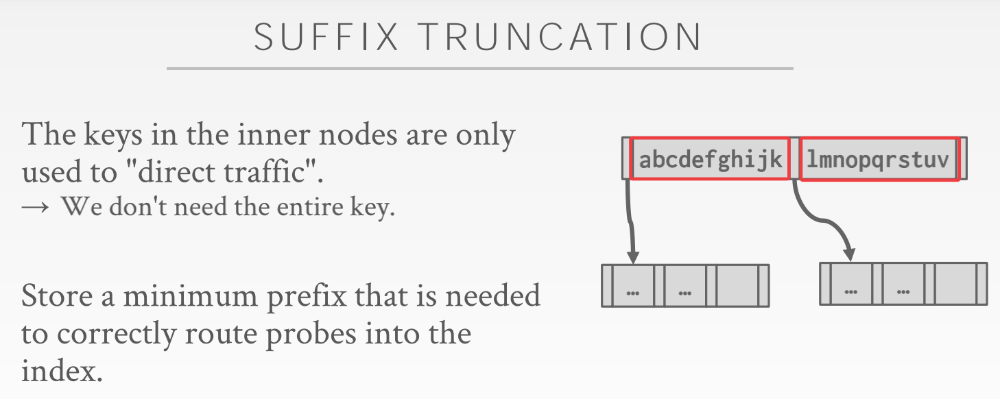

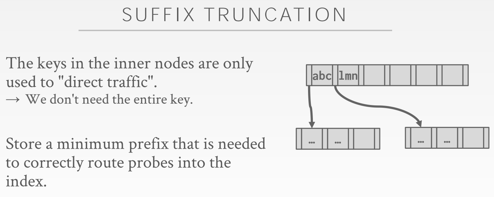

### *2.4 Bulk Insert*

* 初始化B+树再插入键会导致持续的分裂操作。
* 为现有表构建新的B+树的最快方法是首先对键进行排序，然后自下而上构建索引。

### *2.5 Pointer Swizzling*

扩充：
当访问一个数据页时，全内存数据库倾向于使用指针直接访问，而面向磁盘的数据库一般则通过PageID在一个数据结构中间接地获得该数据页的内存地址（当该数据页没有被缓存时需要先读盘）, 然后才能访问到该数据页。

在索引中，节点通过 `page_id` 引用其他节点。如果该页固定在 `buffer pool` 里，可以存储原始指针而不是 `page_id` 。这样避免了从 `page_table` 中查找数据。

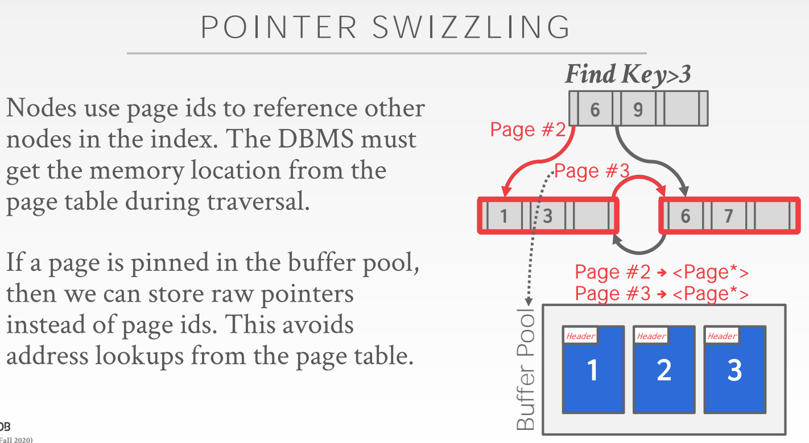

 

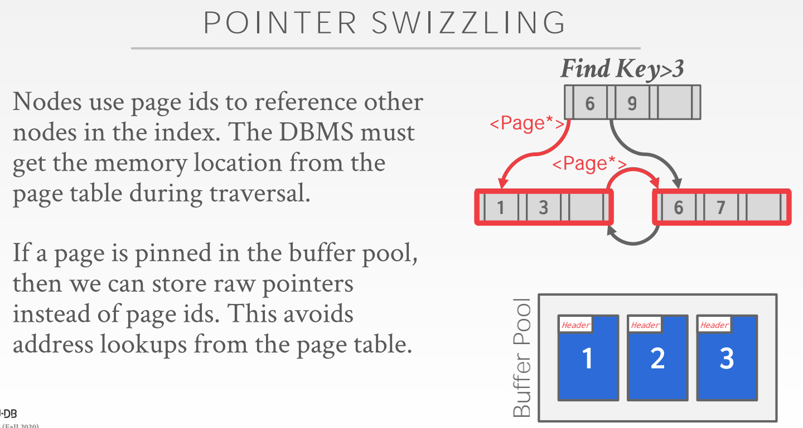

## *3. Additional Index Usage*

### *3.1 Implicit Indexes*

创建一个 `primary key` 或 `unique constraint` ，大多数 `DBMS` 会自动创建一个隐式索引来执行完整性约束，而不是引用约束。

### *3.2 Partial Indexes*

某些情况，用户并不需要对表内所有元组建立索引。部分索引应用了 `where 语句` ，以便包含表的一个子集。这可能会减少维护表的大小和开销，并避免不必要的数据污染缓冲池缓存。一个常用的例子是根据日期来建立部分索引（每月、年等）

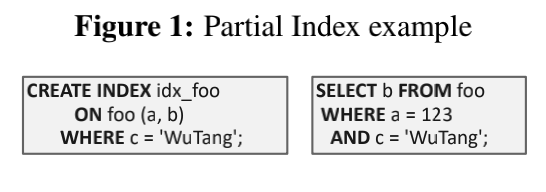

### *3.3 Covering Indexes*

所有需要的域都被包含在索引里， `DBMS` 不需要再取原元组。减少了取数据时间和缓冲池争用。
也叫 `index-only scan`

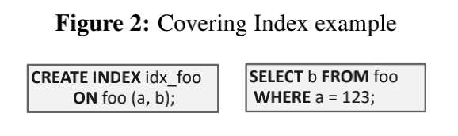

### *3.3 Index Include Columns*

包含列的索引允许用户将额外的列嵌入索引以支持 `index-only scan` 。额外的列仅存在于叶节点中，并不是搜索键的一部分。

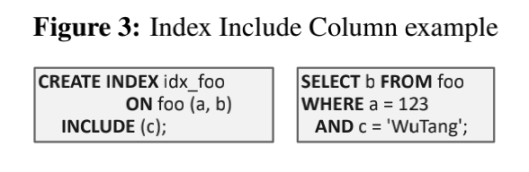

### *3.4 Function/Expression Indexes*

也可以基于函数或表达式创建索引。这样的索引不需要和原表一样存储key。相反，函数、表达式索引存储某个函数或表达式的输出作为其key。DBMS负责鉴别哪些语句能使用该索引。

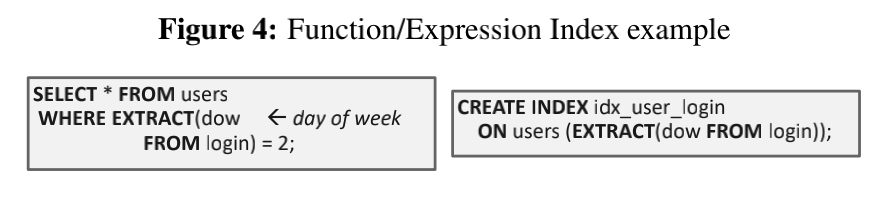

## *4. Trie Index*

不能通过观测一颗B+树来判断索引里是否含有某个key。必须遍历到叶节点才可以。
意味着可能导致每层都有一次缓冲池命中缺失。

使用键的数字表示来一个字符一个字符地验证前缀而不是比较整个key。也叫做数字搜索树（Digital Search Tree）、前缀树（Prefix Tree）。

属性：

* 形状仅依赖于键空间（key space）和长度
* 不依赖于已存在的key或插入顺序
* 不需要重新平衡操作（rebanlance）

所有操作有O(k)的复杂度，k是key的长度。
通向叶节点的路径代表了叶节点的key。
keys是隐性存储，可以根据路径来重构。

trie树每层的跨度是由每个部分键/数字(partial key/digit)的比特数表示的。

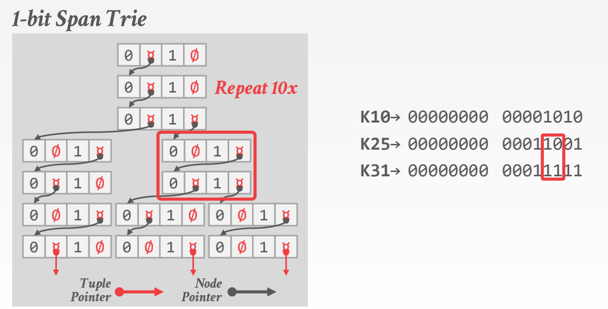

## *5. Radix Tree*

* 也叫做 `Patricia Tree`，trie树的变体。
* 适用长整型数据的映射。
* 用类似01，10这种多bit节点替代1bit节点，减小树高。实际上是多bit节点的子节点拥有共同的前缀01。

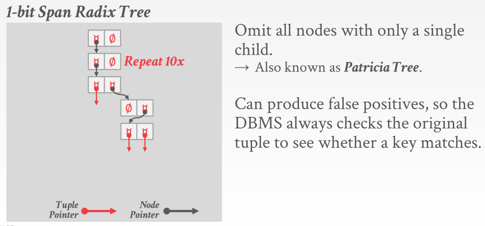

## *6. Inverted Indexes*

lucene，elasticsearch，solr，xapian，sphinx...

* 也叫做全文本搜索索引。
* 倒排索引存储从词语到记录的映射，记录的目标属性包含该词语。

### *6.1 Query Types*

1. Phrases Searches

寻找包含一组给定顺序词语的记录。

2. Proximity Searches（邻近搜索）

寻找两个词在n个词中互相出现的记录（Find records where two words occur within n words of each other）。

3. Wildcard Searches

查询包含符合某种模式词语的记录（eg. 正则）。

### *6.2 Design Decisions*

1. What to store
* 索引至少要存储每条记录所包含的词语（被标点符号分隔）
* 也可以存储词频、位置和其他元数据
2. When to update
* 每次表修改表都去修改倒排索引代价大而且慢，因此，倒排索引经常维护一个额外的数据结构组织这些修改，然后成批修改索引。
