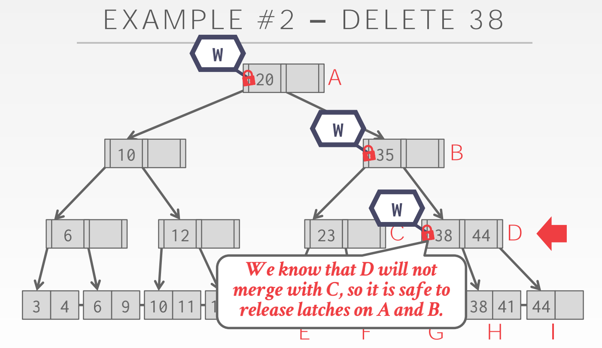
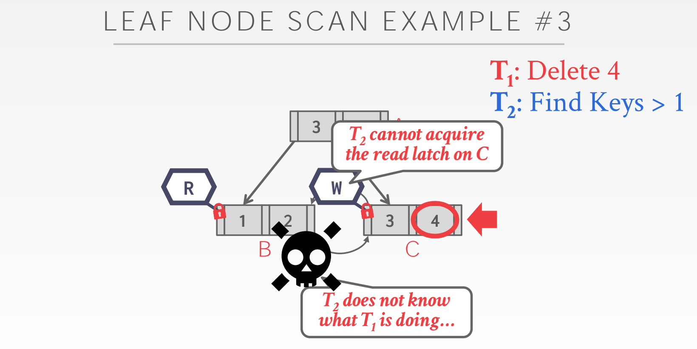
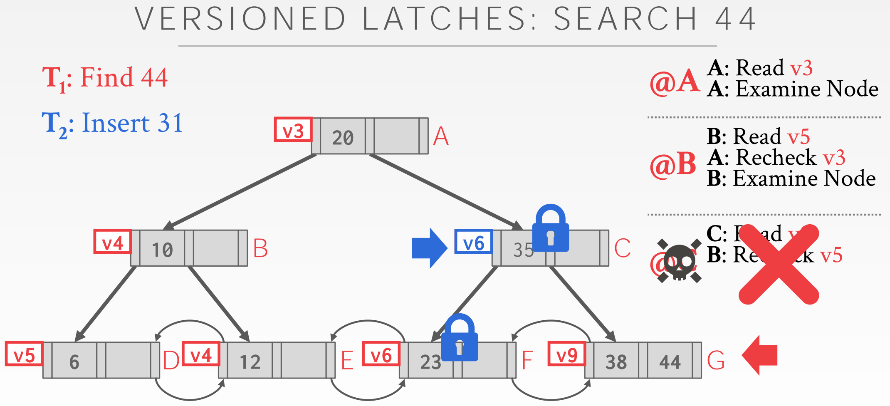

# *Lecture #09: Index Concurrency Control*

## *Overview*

* Latches Overview
* Hash Table Latching
* B+Tree Latching
* Leaf Node Scans
* Delayed Parent Updates

---

## *1. Index Concurrency Control*

协议的正确性标准可能会有所不同:

* 逻辑正确性（Logic Correctness）:

    线程能读取其所应该读的数据

* 物理正确性（Phsical Correctness）:

    数据结构中没有指向非法内存的指针

## 2. *Locks vs. Latches*

* **Locks**
    - 确保数据库内容不受其他事务影响
    - 在事务期间存在
    - 需要支持回滚（rollback）操作
* **Latches**
    - 维护DBMS内部数据的临界区（critical sections）不跟其他线程影响
    - 操作（operation）存在
    - 不需要支持回滚操作

| -           | Locks             | Latches |
|-------------|-------------------|---------|
| 隔离... | 用户线程 | 线程 |
| 维护... | 数据库内容 | 内存中（In-Memory）数据结构 |
| 生命周期... | 整个事务期间 | 临界区 |
| 方法... | Shares, Exclusive, Update, Intention | Read, Write |
| 死锁... | 检测和消除(Detection&Resolution) | 避免(Avoidance) |
| ... 通过...（方式） | 等待、超时、抛弃 | 编码规范 |
| 保持在... | 锁管理器（Lock Manager） | 被维护的数据结构 |

### *2.1 Latch Modes*

* **Read Mode**
    - 多线程可以同时读一个对象
    - 某线程有读锁，另一线程仍可以获取该锁
* **Write Mode**
    - 仅一个线程可以获取这个对象
    - 某线程以任何模式持有该锁，其他线程不能获得该写锁

## *3. Latch Implementations*

### *3.1. Blocking OS Mutex*

* std::mutex
* 使用简单，不需要在 DBMS 额外编码
* 代价昂贵且不可伸缩（non-scalable）（因为系统调用，每次上锁/解锁调用约25ns）

Linux 提供名为 futex(fast user-space mutex) 的锁，由一个用户空间内的 `spin latch` 和一个系统级 `mutex` 组成。DBMS 获取用户空间锁失败，则会切换到内核态尝试获取一个代价更高的锁，若都失败，线程提示系统其在锁上阻塞并取消其调用。

因其是系统管理(OS managed)且代价昂贵，作为解决方案并不明智。

### *3.2. Test-and-Set Spin Latch (TAS)*

[Do not use spinlocks in user space, unless you actually know what you're doing.](https://www.realworldtech.com/forum/?threadid=189711&curpostid=189723)

* std::atomic&lt; T &gt; 
* 效率非常高（latch/unlatch 是单指令操作）
* 不可伸缩
    - 非缓存友好：CAS指令会在不同线程中执行多次。这些被浪费的指令会在高争用环境堆积起来，以致其在系统看来很忙但并没有做有用的工作（自旋使用CPU时间）。会导致缓存一致性问题，因为线程在轮询其他CPU上的 `cache line`。

一个自旋锁存器本质上是线程尝试更新的内存中的某个位置（e.g 一个布尔值变量为自旋锁存器，lock = 1 加锁，lock = 0 解锁）。
某遵循CAS的线程尝试更新某处内存值。线程获取锁存器失败后，DBMS可以决定后续（重试、取消调度等）。
当获取锁存器失败时，这种方法给DBMS更多控制权。

``` 

std::atomic_flag latch;
...
while(latch.test_and_set(...)) {
    // Retry? Yield? Abort?
}
```

**指令 TAS 的定义（原子的）：**

``` 

boolean test_and_set(boolean *target) {
    boolean rv = *target;
    *target = true;

    return rv;
}
```

**采用指令 TAS 的互斥实现：**

``` 

do {
    while(test_and_set(&lock))
        ; /* do nothing */
        
        /* critical section */
    
    lock = false;

        /* remainder section */
} while(true);
```

**指令 CAS 的定义（三个操作数，执行是原子的）：**

``` 

int compare_and_swap(int *value, int expected, int new_value) {
    int temp = *value;

    if (*value == expected)
        *value = new_value;
    
    return temp;
}

```

**采用指令 CAS 的互斥实现：**

``` 

do {
    while(compare_and_swap(&lock, 0, 1) != 0) {
        ; /* do nothing */

        /* critical section */

    lock = 0;
    
        /* remainder section */
    }
} while(true);
```

### *3.3. Reader-Writer Locks*

* 允许并发读
* 必须管理读写队列以避免饥饿，比起 `spin latches` 更大的存储负担（额外的元数据）
* 可以基于自旋锁实现

`Mutexes` 和 `Spin Latches` 不区分读写（不支持不同的模式）。
一个 `Reader-Writer Latch` 允许锁存器被以读或写的模式持有。追踪有多少线程持有或在等待每种模式的锁存器。
读写锁存器使用 `mutex` 或 `spin latch` 中的一种作为基础，并且还有额外的逻辑来处理读写队列（分别存储读、写模式中请求锁存器的数量）。不同 DBMS 有处理队列的不同策略。

## *4. Hash Table Latching*

因为访问数据结构的方法有限，在静态哈希表中支持并发访问很容易。
例如：页表中页/槽按顺序排列，线程每次仅能从上（入口）往下（出口）获取一页/槽（page/slot）。因此不可能发生死锁，没有两个线程互相争用对方持有锁存器的情况（如 P1 当前持有 page1 的写锁，P2 如果要获取 page1 的写锁，则 P2 只能在 P1 上方而不可能持有 page2 的锁）。
需要调整表大小的时候，加一个全局锁然后缩减/扩容。
动态哈希表锁存更复杂，因为有更多共享状态（shared state）需要更新，但大体上一致。

### *4.1 Page Latches*

* 每页都有自己的读写锁。获取页之前先获取锁。这减小了并行（parallelism）因为一个线程一次只能获取一页，但获取一页里面的所有槽（slots）很快，因为只用获取一个锁存器。

### *4.2 Slot Latches*

* 每个槽有自己的锁存器。增加了并行，因为两个线程可以获取同一页中的不同槽。增加了存储和计算负担，因为线程需要为每个槽获取一个锁存器，每个槽也要为锁存器存储数据。DBMS 可以使用单模式锁存器（eg. `Spin Latch`）来减少并行的元数据和计算负担。

## *5. B+Tree Latching*

目的：允许多线程同时读、更新 B+Tree。
需要考虑两种问题：

1. 多个线程同时尝试修改同一个节点的内容。
2. 当某线程分裂、合并节点时，另一节点在遍历树

**Lock crabbing/coupling protocol**

1. 为父节点获取锁存器
2. 为子节点获取锁存器
3. 释放锁存器如果认为副节点是“安全的”。一个“安全的”节点意味着其更新时不会分裂或合并（插入式不满`not full-on`，删除时多于半满`more than half-full`）。

### *5.1 Basic Latch Crabbing Protocol*

* Search：从`root`开始，重复上锁并释放父节点的锁。
* Insert/Delete：从`root`开始，按需获取 X 个锁。一旦子节点上锁，检查其是否“安全”。如果安全，释放所有其祖先的锁。

释放锁的顺序从正确性的角度来看并不重要，但从性能来看，从高处释放锁更好，因为其阻塞了更多节点。
每次都从 `root` 加写锁成为高并发的瓶颈。
因为一致遵循从上往下的顺序，不存在死锁的情况。



### *5.2 Improved Lock Crabbing Protocol*

[《Concurrency of operations on B-trees》（这篇文章没找到资源）](https://link.springer.com/article/10.1007/BF00263762)

大多数对 B+Tree 的修改并不需要分裂及合并操作。
使用读锁乐观地遍历B+Tree，替代假定有分裂或合并操作的悲观遍历。
如果猜错了，使用悲观算法重复遍历。

* Search：算法同上。
* Insert/Delete：上读锁直到叶节点，给叶节点上写锁。如果叶节点不安全，释放之前所有的锁，使用写锁重新开始之前的插入/删除协议。

这种方法乐观的认为只有叶节点需要修改，如果假想错误第一条路径上所有的锁都被浪费。

### *5.3 Leaf Node Scans*

Latches 不支持死锁检测和避免。解决这个问题的唯一方法是通过编码规则（coding discipline）。
叶节点同级锁获取协议必须支持无等待（no-wait）模式。DBMS 的数据结构必须处理获取锁失败的情况。
如果某线程尝试获取某叶节点不可用的锁，其会立即放弃操作（释放所有持有的锁），然后重新开始（restart）操作。



## *6. Others*

### *Delayed Parent Updates*

每次叶节点溢出，必须更新至少三个节点：

1. 分裂节点
2. 新创建的叶节点
3. 父节点

B<sup>link</sup>-Tree Optimization: 当一个叶节点溢出，延迟更新其父节点。

* 分裂节点
* 增加同级新节点，当下次某线程为其父节点加写锁时候更新父节点

### *Versioned Latch Coupling*

每个节点有一个版本号（计数器）

* 每次获得写锁，计数器加 1
* 如果读锁可用，直接读但并不加锁
* 检查父节点自上一次检查后的版本是否变化


