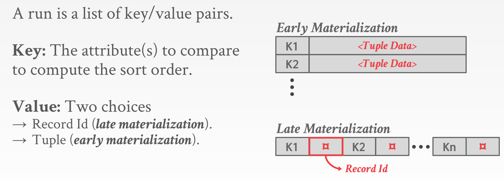
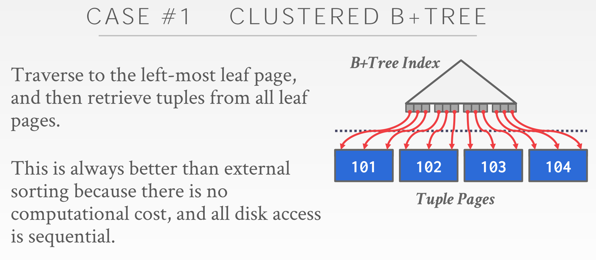
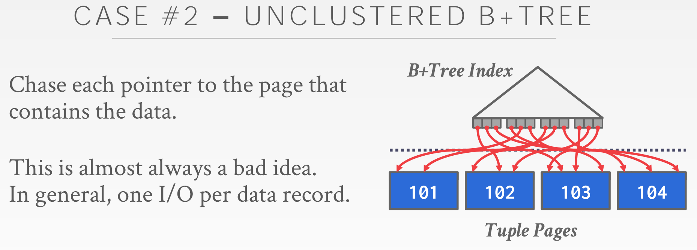
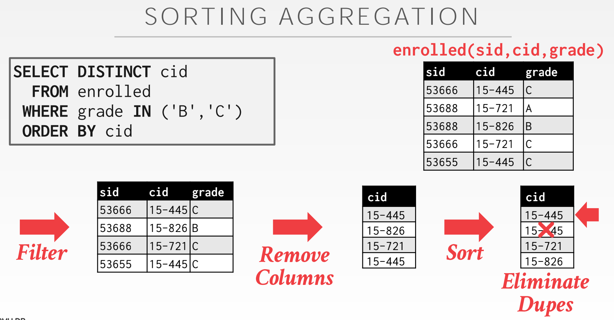
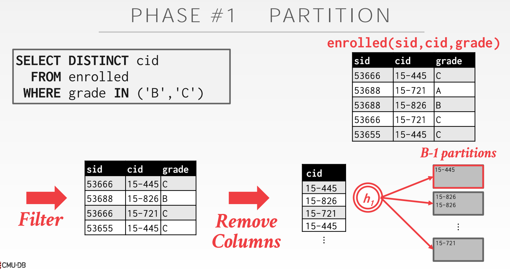
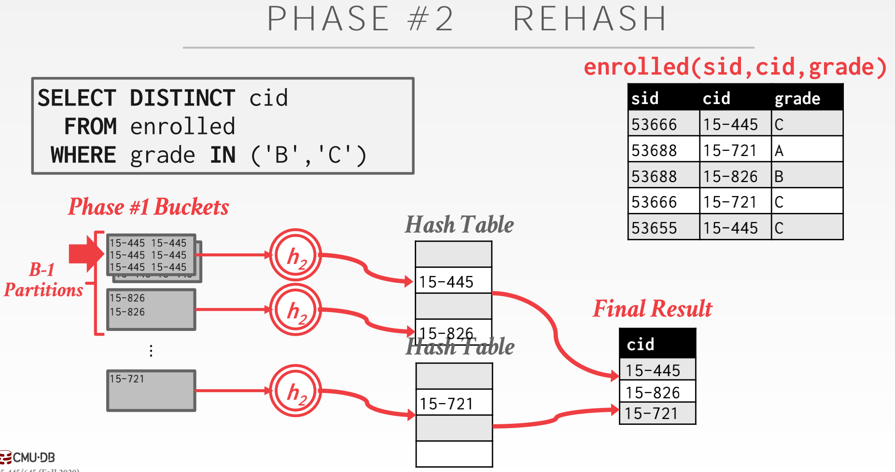
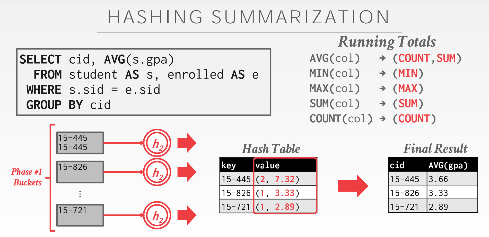

# Lecture #10: Sorting & Aggregation Algorithms

## *1. Sorting* 

### *1.1 External Merge Sort*

Divide-and-conquer algorithm that splits the data set into separate runs, sorts them individually, and then combine into larger sorted runs.

> 分治算法，将数据集分为数个运行集（ `run` ），分别对其进行排序，然后合并成更大的已排序运行集（ `runs` ）。

**Phase #1 - Sorting**

Sort blocks of data that fit in main-memory and then write back the sorted blocks to a file on disk.

> 阶段 #1 - 排序
>> 将主存中的数据块排序，然后写回到磁盘中的已排序的块中。

**Phase #2 - Merging**

Combine sorted sub-files into a single larger file.

> 阶段 #2 - 合并
>> 合并已排序的多个根文件到单个更大的文件。

### *1.2 Sorted Run*

A run is a list of key/value pairs

**Key:**

The attribute(s) to compare to compute the sort order.

> 作为排序依据的属性。

**Value:**

* Two choices.
    - Record Id(late materialization)
    - Tuple(early materialization)

> 两个选择
>> 晚具现化
>> 早具现化

### *1.3 2-Way External Merge Sort*

We will start with a simple example of a 2-way external merge sort.

* "2" represents the number of runs that we are going to merge into a new run for each pass.

> 以简单的 2 路外部归并排序为例
>> “2” 代表了每个流程，我们合并成一个新的运行集所需要旧的运行集的数量。

Data set is broken up into N pages.
The DBMS has a finite number of B buffer pages to hold input and output data.

> 数据集被分为 N 页。
> 数据库管理系统维护有限的缓存页（ B 页），来容纳输入和输出数据。

**Pass #0**

* Read every B pages of the table into memory.

* Sort pages into runs and write them back to disk.

> 流程 #0
>> 每次从表中读 B 页到内存。
>> 将页排序成为运行集并写回磁盘。

**Pass #1, 2, 3, ...**

* Recursively merges pairs of runs into runs twice as long.

* Uses three buffer pages (2 for input pages, 1 for output).

> 流程 #1, 2, 3, ...
>> 递归的将运行集对合并为两倍长度。
>> 使用三页缓存（2 页输入，1页输出）

But even if we have more buffer space available (B>3), it does not effectively utilize them if the worker must block on disk I/O…

> 如果 worker 必须阻塞磁盘IO，即使我们有更多的缓存空间，也不能有效利用这些缓存。

### *1.4 Double Buffering Optimization*

Prefetch the next run in the background and store it in a second buffer while the system is processing the current run.

* Reduces the wait time for I/O requests at each step by continuously utilizing the disk.

> 系统处理当前运行集时，后台预取下一个运行集并存储到副缓存。
>> 通过持续利用磁盘来减少 I/O 请求运行时间

### *1.5 General(K-way) Merge Sort*

B buffer pages
During the sort phase, the algorithm can read B pages at a time and write⌈N/B⌉sorted runs back to disk.
The merge phase can also combine up to B - 1 runs in each pass, again using one buffer page for the combined data and writing back to disk as needed.

> 排序期间，算法一次读 B 页并写回 ⌈N/B⌉ 个运行集到磁盘。
> 合并阶段，每个流程可以合并至多 B - 1 个运行集，并使用 1 个缓冲页作为合并后结果写回磁盘。

Number of passes = 1 + ⌈ logB-1 ⌈N / B⌉ ⌉
Total I/O Cost = 2N ∙ (# of passes)

### *1.6 Using B+Trees*

* **CASE #1:** Traverse to the left-most leaf page, and then retrieve tuples from all leaf pages. This is always better than external sorting because there is no computational cost, and all disk access is sequential.

* **CASE #2:** Chase each pointer to the page that contains the data. This is almost always a bad idea. In general, one I/O per data record.

> 遍历到最左叶节点。从所有叶节点获取 tuples。总是比外部排序好，因为没有计算消耗，而且所有磁盘访问都是连续的。
> 跟踪每个指针到包含该数据的页。坏主意，大体上说每条记录需要一次 I/O 操作。

## *2. Aggregations*

Collapse values for a single attribute from multiple tuples into a single scalar value.
Two implementation choices:

1. Sorting
2. Hashing

### *2.1 Sorting*

The DBMS first sorts the tuples on the GROUP BY key(s). It can use either an in-memory sorting algorithm if everything fits in the buffer pool (e.g., quicksort) or the external merge sort algorithm if the size of the data exceeds memory. The DBMS then performs a sequential scan over the sorted data to compute the aggregation. The output of the operator will be sorted on the keys. When performing sorting aggregations, it is important to order the query operations to maximize efficiency. For example, if the query requires a filter, it is better to perform the filter first and then sort the filtered data to reduce the amount of data that needs to be sorted.

> 首先对 `GROUP BY` 的键排序。根据内存和载入数据大小选择 `in-memory ` 排序（快排）或外部合并排序。使用排序聚合时，需要合理安排查询操作以最大化效率。如，先 `filter` 再排序，使得加载数据更小，最好能 `in-memory` 排序。

###  *2.2 Hashing*

Hashing can be computationally cheaper than sorting for computing aggregations. The DBMS populates an ephemeral hash table as it scans the table. For each record, check whether there is already an entry in the hash table and perform the appropriate modification. If the size of the hash table is too large to fit in memory, then the DBMS has to spill it to disk. There are two phases to accomplishing this:

> 计算聚合 `Hashing` 消耗更小（只消重，不排序）。生成一个临时 `hashtable` ，扫描表，检查记录是否已存在，修改。 `hashtable` 大于内存，DBMS 需要将其分裂到磁盘。

**Phase #1 - Partition:**
Use a hash function h1 to split tuples into partitions on disk based on target hash key.

* A partition is one or more pages that contain the set of keys with the same hash value. 
* Partitions are "spilled" to disk via output buffers.

> 使用哈希函数 h1 根据目标哈希键将元组划分为磁盘上的数个分区
>> 一个分区代表数页拥有一系列拥有相同值的键
>> “分区”通过缓存输出到磁盘

**Phase #2 - Rehash:**

For each partition on disk, read its pages into memory and build an in-memory hash table based on a second hash function h2 (where h1 = h2). Then go through each bucket of this hash table to bring together matching tuples to compute the aggregation. This assumes that each partition fits in memory.

> 对于磁盘上的每个分区，读取磁盘页，根据哈希函数 h2 构建一个内存中哈希表（where h1 != h2）。遍历哈希表的每个桶，取满足条件的元组计算聚合。假定每个分区能放入内存。

During the ReHash phase, the DBMS can store pairs of the form (GroupByKey→RunningValue) to compute the aggregation. The contents of RunningValue depends on the aggregation function. To insert a new tuple
into the hash table:
• If it finds a matching GroupByKey, then update the RunningValue appropriately.
• Else insert a new (GroupByKey→RunningValue) pair.

> Rehash 阶段，DBMS以（GroupKey -> RunningValue）的形式存储并计算聚合。RunningValue 的内容取决于聚合函数。
>> 找到匹配的 GroupByKey，更新 RunningValue。
>> 或者插入一个新的 (GroupByKey->RunningValue) 对。

