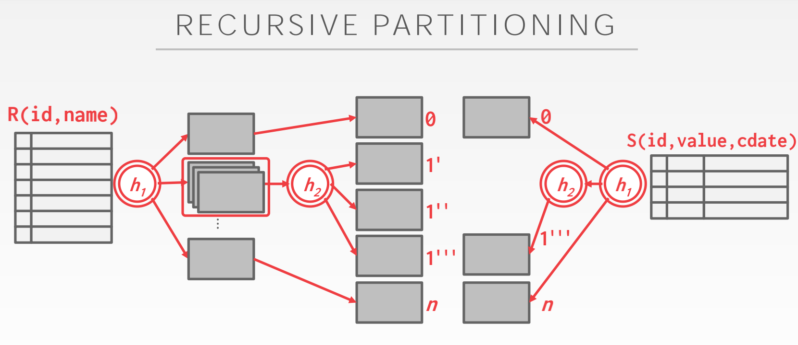

# Lecture #11: Joins Algorithms

## *1 Joins*

### *1.1 Operator Output*

For tuple r ∈ R and tuple s ∈ S that match on join attributes, concatenate r and s together into a new tuple.

> 对于在连接属性中匹配的 R 和 S 的子集元组，连接 r 和 s 到一个新的元组。

Output contents can vary:

* Depends on processing model
* Depends on storage model
* Depends on data requirements in query

> 输出内容因以下内容不同
>> DBMS 的处理模型
>> DBMS 的存储模型
>> 查询语句中请求的数据

Data: This approach copies the values for the attributes in the outer and inner tables into tuples put into an intermediate result table just for that operator. The advantage of this approach is that future operators in the query plan never need to go back to the base tables to get more data. The disadvantage is that this requires more memory to materialize the entire tuple.
The DBMS can also do additional computation and omit attributes which will not be needed later in the query to further optimize this approach.

> 数据
>> 这种方法将外部表和内部表中的属性值复制到元组中，并将这些元组放入一个中间结果表中，只用于该运算符。这种方法的优点是，查询计划中的之后的运算符永远不需要返回基表来获取更多数据。缺点是这需要更多内存来具体化整个元组。</br>DBMS 还可以进行额外的计算，并省略查询中稍后不需要的属性，以进一步优化这种方法。

Record Ids: In this approach, the DBMS only copies the join keys along with the record ids of the matching tuples. This approach is ideal for column stores because the DBMS does not copy data that is not needed for the query. This is called late materialization.

> 记录ID
>> 在这种方法中，DBMS只复制连接键和匹配元组的记录id。这种方法非常适合列存储，因为DBMS不复制查询不需要的数据。这叫做延迟具体化。

### *1.2 Cost Analysis*

The cost metric used here to analyze the different join algorithms will be the number of disk I/Os used to compute the join. This includes I/Os incurred by reading data from disk as well as writing any intermediate data out to disk. Note that only I/Os from computing the join are considered, while I/O incurred when outputting the result is not. This is because the output for any algorithm will be the same, so the output cost will not change among different algorithms.

> 这里用于分析不同连接算法的成本指标是指用于计算连接的磁盘I/O数量。这包括从磁盘读取数据以及将任何中间数据写入磁盘所产生的I/O。请注意，只考虑来自计算联接的I/O，而不考虑输出结果时产生的I/O。这是因为任何算法的输出都是相同的，所以不同算法的输出成本不会发生变化。

In general, there will be many algorithms/optimizations which can reduce join costs in some cases, but no
single algorithm which works well in every scenario.

> 一般来说，在某些情况下，会有许多算法/优化可以降低连接成本，但没有一个算法在每个场景中都能很好地工作。

## *2 Nested Loop Join*

``` 

// 本讲后面将要使用的变量
Variables used in this lecture:
    • M pages in table R (Outer Table), m tuples total
    • N pages in table S (Inner Table), n tuples total
```

At a high-level, this type of join algorithm is comprised of two nested for loops that iterate over the tuples in both tables and compares each unique of them. If the tuples match the join predicate, then output them. The table in the outer for loop is called the outer table, while the table in the inner for loop is called the inner table.

> 在高层，这种类型的连接算法由两个嵌套的for循环组成，循环遍历两个表中的元组，并比较每个元组的唯一性。如果元组与连接谓词匹配，则输出它们。外部for循环中的表称为外部表，而内部for循环中的表称为内部表。

The DBMS will always want to use the “smaller” table as the outer table. Smaller can be in terms of the number of tuples or number of pages. The DBMS will also want to buffer as much of the outer table in memory as possible. It can also try to leverage an index to find matches in inner table.

> DBMS总是希望使用“较小”表作为外部表。更小的可以是元组的数量或页面的数量。DBMS还需要在内存中缓冲尽可能多的外部表。它还可以尝试利用索引在内部表中查找匹配项。

``` 

// R 即是 Outer 表, S 即是 Inner 表
SELECT R.id, S.cdate
  FROM R JOIN S
    ON R.id = S.id
 WHERE S.value > 100
```

### *2.1 Simple Nested Loop Join*

``` 

foreach tuple r ∈ R:        // Outer
    foreach tuple s ∈ S:    // Inner
        emit, if r and s match
```

For each tuple in the outer table, compare it with each tuple in the inner table. This is the worst case scenario where the DBMS must do an entire scan of the inner table for each tuple in the outer table without any caching or access locality.

> 对于外部表中的每个元组，将其与内部表中的每个元组进行比较。这是最坏的情况，在这种情况下，DBMS必须对外部表中的每个元组执行内部表的整个扫描，而没有任何缓存或局部访问。

Why is this algorithm `stupid` ?

**For every tuple in R, it scans S once**
**Cost:** $ M + (m \times N) $

``` 

Example Database:
    -> Table R: M = 1000, m = 100,000
    -> Table S: N = 500 , n = 40,000

Cost Analysis:
    -> M + (m * N) = 1000 + (100000 * 500) = 50,001,000 IOs
    -> At 0.1ms/IO, Total time ≈ 1.3 hours

Smaller table (S) is used as the outer table:
    -> N + (n ∙ M) = 500 + (40000 ∙ 1000) = 40,000,500 IOs
    -> At 0.1 ms/IO, Total time ≈ 1.1 hours
```

### *2.2 Block Nested Loop Join*

#### *2.2.1 Without Buffers*

``` 

foreach block B_R ∈ R:
    foreach block B_S ∈ S:
        foreach tuple r ∈ B_R: 
            foreach tuple s ∈ B_S:
                emit, if r and s match
```

For each block in the outer table, fetch each block from the inner table and compare all the tuples in those two blocks. This algorithm performs fewer disk access because the DBMS scans the inner table for every outer table block instead of for every tuple.

> 对于外部表中的每个块，从内部表获取每个块并比较这两个块中的所有元组。这种算法执行较少的磁盘访问，因为DBMS为了每个外部表块扫描内部表，而不是每个元组。

This algorithm performs fewer disk accesses.

**For every block in R, it scans S once**
*Cost:* $ M + (M \times N) $

``` 

Example database:
    -> Table R: M = 1000, m = 100,000
    -> Table S: N = 500, n = 40,000 
Cost Analysis:
    -> M + (M ∙ N) = 1000 + (1000 ∙ 500) = 501,000 IOs
    -> At 0.1 ms/IO, Total time ≈ 50 seconds
```

#### *2.2.2 With B Buffers*

``` 

foreach B - 2 blocks b_R ∈ R:
    foreach block b_S ∈ S:
        foreach tuple r ∈ B - 2 blocks:
            foreach tuple s ∈ b_S:
                emit, if r and s match
```

If the DBMS has B buffers available to compute the join, then it can use B - 2 buffers to scan the outer table. It will use one buffer to scan the inner table and one buffer to store the output of the join.

> 如果DBMS有B个缓冲区可用于计算联接，则可以使用B-2缓冲区扫描外部表。它将使用一个缓冲区来扫描内部表，并使用一个缓冲区来存储联接的输出。

*Cost:* $ M + (\lceil\frac{M}{B - 2}\rceil \times N) $

``` 

What if the outer relation completely fits in memory (B > M+2)?
    -> Cost: M + N = 1000 + 500 = 1500 IOs
    -> At 0.1ms/IO, Total time ≈ 0.15 seconds
```

### *2.3 Index Nested Loop Join*

``` 

foreach tuple r ∈ R:
    foreach tuple s ∈ Index(r_i = s_j): 
        emit, if r and s match
```

The previous nested loop join algorithms perform poorly because the DBMS has to do a sequential scan to check for a match in the inner table. However, if the database already has an index for one of the tables on the join key, it can use that to speed up the comparison. The DBMS can either use an existing index or build a temporary one for the join operation.

> 之前的嵌套循环连接算法表现很差，因为DBMS必须执行顺序扫描来检查内部表中是否匹配。但是，如果数据库已经为某个表上的联接键建立了索引，则可以使用该索引来加快比较速度。DBMS可以使用现有索引，也可以为join操作构建临时索引。

The outer table will be the one without an index. The inner table will be the one with the index.

> 外部表将是没有索引的表。内部表将是具有索引的表。

Assume the cost of each index probe is some constant value C per tuple.

> 假设每个索引探测的开销是每个元组的某个常量值C。

*Cost:* $ M + (m \times C) $

## *3 Sort-Merge Join*

``` 

sort R,S on join keys
cursor_R ← R_sorted, cursor_S ← S_sorted
while cursor_R and cursor_S:
    if cursor_R > cursor_S:
        increment cursor_S
    if cursor_R < cursor_S:
        increment cursor_R
    elif cursor_R and cursor_S match:
        emit
        increment cursor_S
```

Phase #1: Sort

* Sort both tables on the join key(s).
* We can use the external merge sort algorithm that we talked about last class.

> 根据联接键分别对两张表排序
> 使用外部排序算法

Phase #2: Merge

* Step through the two sorted tables with cursors and emit matching tuples.
* May need to backtrack depending on the join type.

> 使用游标单步执行两个已排序的表并将匹配的元组写入输出缓存。
> 可能需要根据联接类型回溯。

**Sort** Cost(R): $ 2M \times (1 + \lceil log_{B-1} \lceil \frac {M}{B} \rceil\rceil) $

**Sort** Cost(S): $ 2M \times (1 + \lceil log_{B-1} \lceil \frac{N}{B} \rceil \rceil) $

**Merge** Cost: $ (M + N) $

Total Cost: **Sort + Merge**

``` 

Example database:
    -> Table R: M = 1000, m = 100,000
    -> Table S: N = 500, n = 40,000

With B=100 buffer pages, both R and S can be sorted in two passes:
    -> Sort Cost (R) = 2000 ∙ (1 + ⌈log99 1000 /100⌉) = 4000 IOs
    -> Sort Cost (S) = 1000 ∙ (1 + ⌈ log99 500 / 100⌉) = 2000 IOs
    -> Merge Cost = (1000 + 500) = 1500 IOs
    -> Total Cost = 4000 + 2000 + 1500 = 7500 IOs
    -> At 0.1 ms/IO, Total time ≈ 0.75 seconds
```

When is Sort-Merge join useful?

1. One or both tables are already sorted on join key.
2. Output must be sorted on join key.

> 什么时候排序归并联接是有用的
>> 某个表或两张表早已经按照联接键排序
>> 输出必须按照联接键排序

## *4 Hash-Join*

The high-level idea of the hash join algorithm is to use a hash table to split up the tuples into smaller chunks based on their join attribute(s). This reduces the number of comparisons that the DBMS needs to perform per tuple to compute the join. Hash join can only be used for equi-joins on the complete join key.

> 哈希连接算法的高级思想是使用哈希表根据元组的连接属性将元组拆分为更小的块。这减少了DBMS在计算连接时需要对每个元组执行的比较次数。哈希联接只能用于完整联接键上的对等联接。

If tuple r ∈ R and a tuple s ∈ S satisfy the join condition, then they have the same value for the join attributes. If that value is hashed to some value i, the R tuple has to be in bucket ri, and the S tuple has to be in bucket si. Thus, the R tuples in bucket ri need only to be compared with the S tuples in bucket si.

> 如果 r ∈ R 且 s ∈ S 满足联接条件，对于联接属性，他们有相同的值。如果该值被哈序到某个值i，元组R必须在桶$r_i$中，且元组S必须在桶$s_i$中。

### *4.1 Basic Hash Join*

``` 

build hash table HT_R for R
foreach tuple s ∈ S
    output, if h1(s) ∈ HT_R
```

1. Build: First, scan the outer relation and populate a hash table using the hash function h1 on the join attributes. The key in the hash table is the join attributes. The value depends on the implementation (can be full tuple values or a tuple id).

> 首先，扫描外部关系并对联接属性使用hash函数h1生成哈希表。哈希表中的键是联接属性。该值取决于实现（可以是完整的元组值或元组id）。

2. Probe:  Scan the inner relation and use the hash function h1 on each tuple’s join attributes to jump to the corresponding location in the hash table and find a matching tuple. Since there may be collisions in the hash table, the DBMS will need to examine the original values of the join attribute(s) to determine whether tuples are truly matching.

> 扫描内部关系并在每个元组的联接属性上使用hash函数h1来跳转到哈希表中的相应位置并找到匹配的元组。由于哈希表中可能存在冲突，DBMS将需要检查联接属性的原始值（键值），以确定元组是否真正匹配。

If the DBMS knows the size of the outer table, the join can use a static hash table. If it does not know the
size, then the join has to use a dynamic hash table or allow for overflow pages.

> 如果DBMS知道外部表的大小，则连接可以使用静态哈希表。如果不知道大小，则连接必须使用动态哈希表或允许溢出页。

### *4.2 Grace Hash Join/Hybrid hash Join*

``` 

foreach tuple r ∈ bucketR,0:
    foreach tuple s ∈ bucketS,0: 
        emit, if match(r, s)
```

When the tables do not fit on main memory, the DBMS has to swap tables in and out essentially at random, which leads to poor performance. The Grace Hash Join is an extension of the basic hash join that also hashes the inner table into partitions that are written out to disk.

> 当表不在内存中时，数据库管理系统必须随机地交换表，导致性能下降。优雅散列联接是基本散列联接的扩展，该哈希也将内部表哈希为写入磁盘的分区。

1. Build: First, scan both the outer and inner tables and populate a hash table using the hash function h1 on the join attributes. The hash table’s buckets are written out to disk as needed. If a single bucket does not fit in memory, the DBMS can use recursive partitioning with different hash function h2 (where h1 = h2) to further divide the bucket. This can continue recursively until the buckets fit into memory.

> 首先，扫描外部表和内部表，并使用联接属性上的hash函数h1填充哈希表。hash表的buckets被按需写入磁盘。如果单个bucket无法载入内存，DBMS可以使用不同的哈希函数h2（其中h1 != h2）的递归分区来进一步划分bucket。这可以递归地继续，直到存储桶装入内存。

2. Probe: For each bucket level, retrieve the corresponding pages for both outer and inner tables. Then, perform a nested loop join on the tuples in those two pages. The pages will fit in memory, so this join operation will be fast.

> 对于每个bucket级别，检索外部表和内部表的相应页面。然后，对这两个页面中的元组执行嵌套循环联接。这些页将放入内存中，因此此联接操作将很快。



Partition Phase Cost: $ 2 \times (M + N) $
Probe Phase Cost: $ (M + N) $
Total Cost: $ 3 \times (M + N) $
