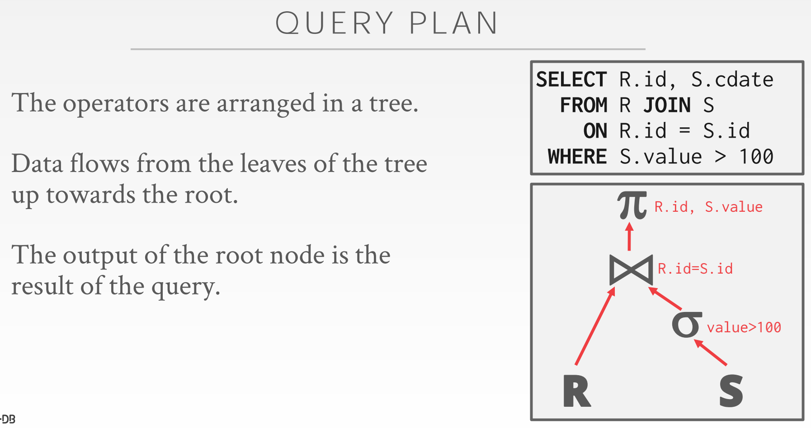
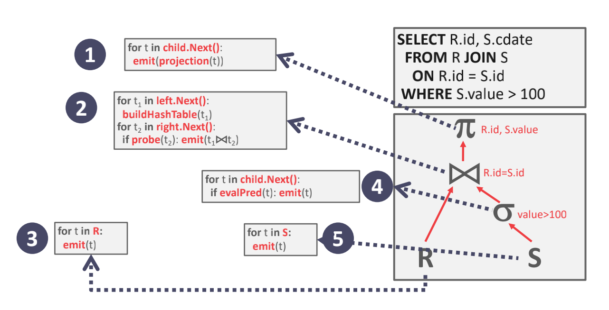
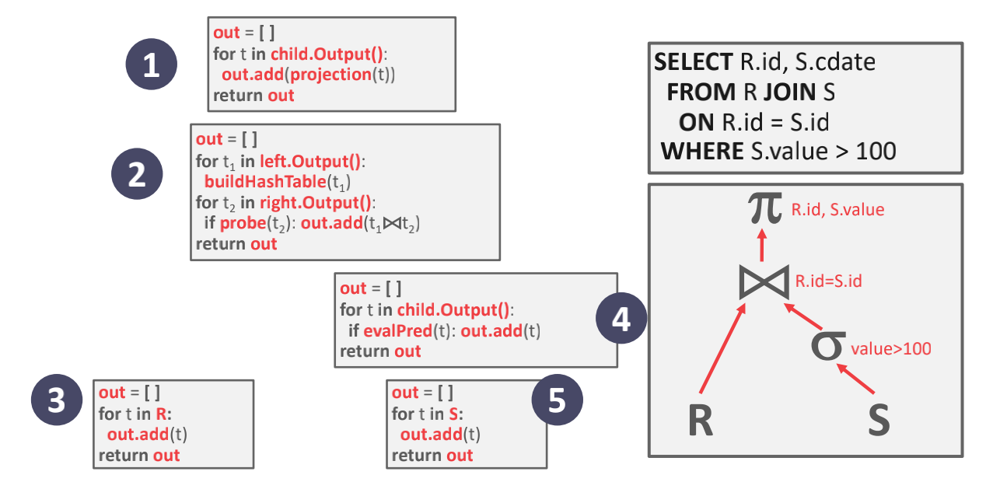
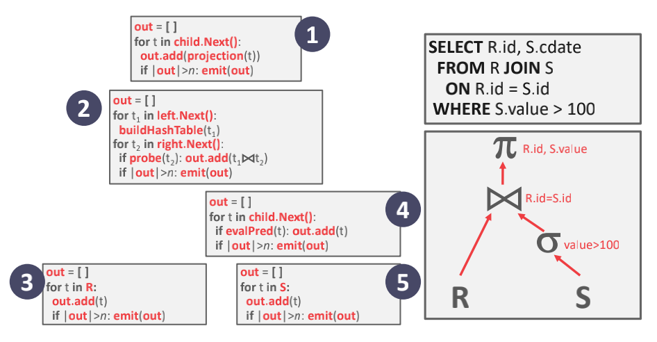
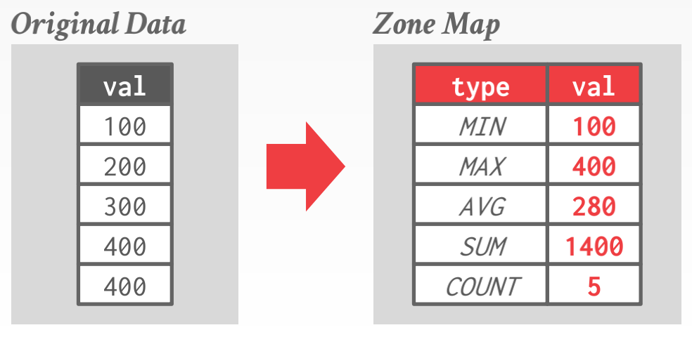

# Lecture #12: Query Execution I

## *1. Query Plan（查询计划）*

DBMS将SQL语句转换为 `query plan` 。
通常运算符是二元的（1-2个子运算符）。同一个 `query plan` 可以多种方式执行。大多数dbms都希望尽可能多地使用索引扫描。



## *2. Processing Models（处理模型）*

DBMS处理模型定义系统**如何执行 query plan** 。它指定诸如 `query plan` 读入的方向，以及沿途在运算符之间传递的数据类型。处理模型有不同的模型，它们对不同的工作负载有不同的权衡。
这些模型也可以实现为从上到下或从下到上调用运算符。虽然top-to-bottom方法更常见，但是bottom-to-top方法可以更严格地控制流程中的缓存/寄存器。

### *2.1 Iterator Model （迭代器模型）*

* 每层返回结果都是符合条件过滤的。
* 每次next调用，符号返回一个元组（理解为数据库里的一条记录），如果没有更多的元组的话，返回一个null标记（null marker）。
* 符号循环调用其子节点的next()方法，然后处理这些结果（返回值）。
    - 当前层做循环，每个单次循环向下迭代 child.next()，所以实际上是循环迭代。即调用顺序是自上而下。
    - 而实际数据流向则是自下而上。
* 也叫做“火山”或“流水线”（pipeline）模型。
* 几乎被所有DBMD使用。允许用于处理元组流水线。
* 一些运算符必须阻塞直到他们的子节点处理完其所有的元组。
    - Joins，Subqueries，Order By
* 这种方法非常容易做输出控制。
    - LIMIT，一旦满足上层要求，立即停止下层的next()调用。
* 采用此模型的数据库
    - SQLite, mongoDB, PostgreSQL, Oracle, MySQL, SQL Server, DB2



### *2.2 Materialization Model（物化模型）*

* 迭代器模型的特例，即将所有结果返回root再做投影（project）
* 每个运算符一次处理其所有输入（整张表，可以看见在图1中底层步骤没有做投影，而是在root处做投影）并一次输出其所有结果（返回值、输出）。
    - 运算符具化其输出为单个结果
* 在 OLTP 工作集又更好的表现，因为每次查询只获取一小部分元组
    - 较低的执行，协调开销
    - 更少的函数调用
* 对需要大量立即结果的 OLAP 不友好



### *2.3 Vectorization Model（向量化模型）*

* 像 Iterator Model 一样，每个运算符都实现一个 next() 函数
* 运算符输出一个 tuples 组成的 batch (i.e., vector) 而不是单个 tuple (Iterator Model)
    - 运算符内循环一次处理多个元组
    - batch 的大小根据硬件或查询属性而不同
* 适合必须扫描大量元组的 OLAP 查询，因为有更少的 next 函数调用

采用此模型的数据库：

    snowflake, SQL Server, DB2, Oracle



## 3. Plan Processing Direction（计划执行方向）:

1. 自顶向下：
    - root 开始，从子节点拉取数据
    - tuples 总是通过函数调用的方式进行传递
2. 自底向上：
    - 从 leaf nodes 开始，推送数据到父节点
    - 允许更严格地控制流水线的缓存或寄存器

## *4. Access Methods（获取方法）*

即 DBMS 获取 table 中数据的方式，在 relationl algebra 中没有定义

### *4.1 Sequential Scan（顺序扫描）*

* 对于表中的每一页
    - 从 buffer pool 中获取该页
    - 遍历所有 tuple 并检查是否 include 该页

``` 

for page in table.pages:
    for t in page.tuples:
        if evalPred(t):
            // Do Something
```

* DBMS 维护一个内部的 cursor（游标）来追踪其所检验过的最后一页/槽
* 这几乎是 DBMS 执行查询最坏的选择
* 优化：
    - Prefetching（预取）
        + 预先获取接下来的几页，DBMS 访问时不需要阻塞
    - Buffer Pool Bypass
        + 扫描运算符将其从磁盘取出的 pages 存储到其本地内存中而不是 buffer pool，以防 sequential flooding（序列洪泛）
    - Parallelization
        + 多线程/进程并行扫描
    - Heap Clustering
        + tuples 遵循 clustering index（聚集索引）声明的顺序存储在 heap pages
    - Zone Maps
    - Late Materialization（延迟具现化）
        + 每个运算法传递下个运算符所需的最少信息（e.g., record id, offset in column）。只适用于行存储系统。

#### 4.1.1 *Zone Maps*

在 page 中预先计算 attribute 的 aggregates（聚合）。
DBMS 首先检查 zone map 来决定是否要获取该页。
使用数据库：
SQL Server, Oracle

``` 

SELECT * from table WHERE val > 600
```



### *4.2 Index Scan（索引扫描）*

如果 DBMD 可以将多个索引用于一个查询：

* 使用列对应的索引分别计算由记录ids组成的集合
* 根据查询的谓语合并这些集合（并集 vs 交集）
* 获取这些记录并执行剩下的谓语
* 集合交集可以用 `bitmaps`，hash tables 或 `Bloom filters` 来做

``` 

-> Index #1: age
-> Index #2: dept
SELECT * FROM students
WHERE age < 30
AND dept = 'CS'
AND contry = 'US'

-> 获取符合 age < 30 的记录的 ids，使用索引 1
-> 获取符合 dept = 'CS' 的记录的 ids，使用索引 2
-> 做交集
-> 获取所有记录并检查 contry = 'US'
```

## *5. Modification Queries*

修改数据的运算符（INSERT，UPDATE，DELETE）需要检查一致性和更新索引。
对于 UPDATE/DELETE 来说，子运算符传递目标 tuples 的 ids，而且必须 keep track of previously seen tuples。
两种处理 INSERT 的方法：

1. 在运算符内具现化 tuples
2. 运算符插入所有子运算符返回的 tuples

``` 

注意 Update 操作

CREATE INDEX idx_salary ON people (salary);
UPDATE people SET salary = salary + 100 WHERE salary < 100;

// 这里执行了:
// 1 次删除索引
// 1 次更新数据
// 1 次插入索引
// 所以并不是 更新 = 删除 + 插入
// UPDATE = DELETE_INDEX + UPDATE_COLUMN + INSERT_INDEX
for t in child.next():
    removeFromIndex(idx_salary, t.salary, t)
    updateTuple(t.salary = t.salary + 1000)
    insertIntoIndex(idx_salary, t.salary, t)

若是 删除 + 插入呢？
则应该是：
    删除索引 + 删除数据
    插入数据 + 插入索引
```
