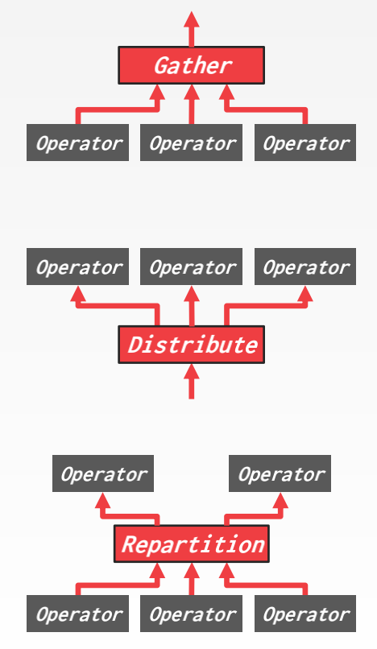
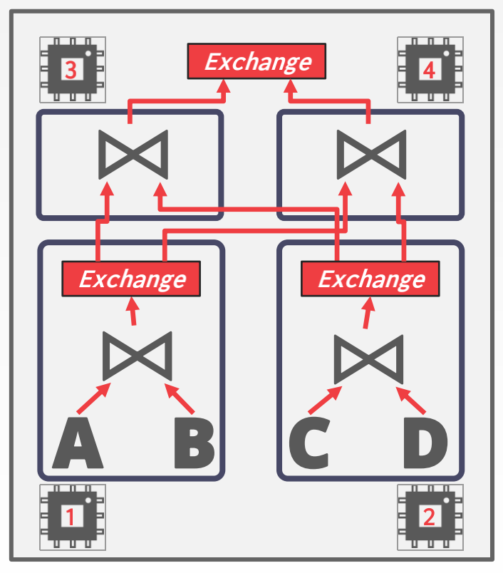
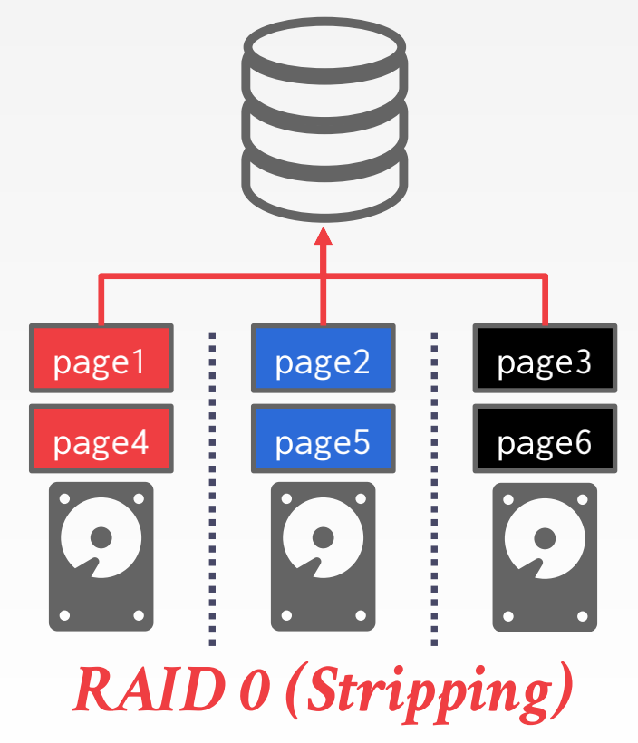
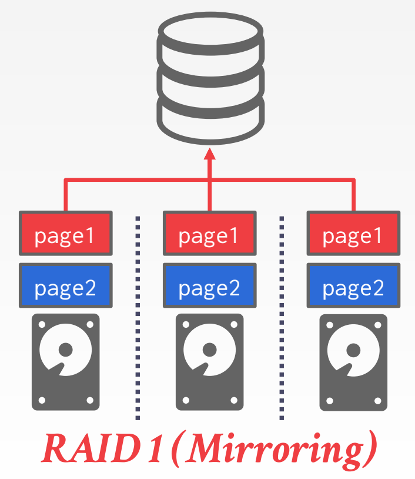
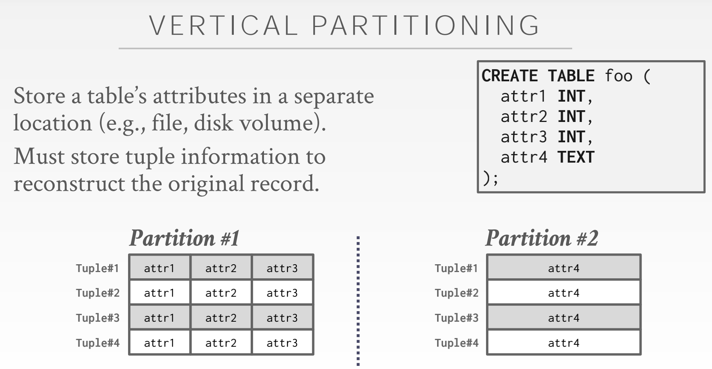
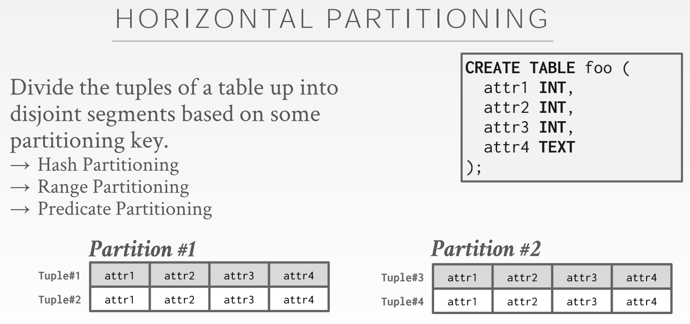

# Lecture #13:  Query Execution II

## Background

上一节：如何将运算符组合以执行一个查询计划(query plan)
本节：怎样使用多个 workers 来执行

## Parallel vs. Distributed

Parallel DBMSs:

* 资源在物理意义上互相靠近
* 资源通过高速互联通信
* 通信被认为是廉价且可靠的

Distributed DBMSs:

* 资源之间可能相距很远
* 资源使用更慢的互联进行通信
* 通信消耗打且各种问题不能避免

## Process Model（处理模型）

一个 DBMS 的处理模型定义了系统是如何架构的，以支持来自多用户应用的并发请求。
一个 worker 是负责处理来自客户端任务并返回结果的 DBMS 组件，worker 实际上是一个抽象的概念，可以是一类特定的进程，也可以是一类特定的线程等。

### Process per DBMS Worker

每个 worker 是一个独立的系统进程，因此依赖于系统调度器。
应用发送请求于数据库系统建立连接, 分发器接受请求并 fork off 一个 worker 来处理这个连接。然后应用直接和该 worker 通信。
会导致多个进程上的 worker 拥有大量相同页的 copy。为了减少内存使用，可以对全局的数据结构使用共享内存，以便其被多个进程共同使用。
优点是，一个进程崩溃了不会中断整个系统。
例子：IBM DB2, Postgres, Oracle

### Process Pool

区别于每个连接请求都 fork 一个进程，workers 被维持在 pool 里。每次处理查询的时候，分发器就从进程池中选择一个 worker （一个进程）来处理这次请求。而且因为进程都在同一个池里，他们之间可以共享查询，或并行查询。
仍然依赖于系统调度器和共享内存。
对 CPU 本地缓存不友好，不同的请求并不能保证被相同的进程处理。
例子：IBM DB2, Postgres(2015)。

### Thread per DBMS Worker

每个数据库系统只有一个主进程，该进程含多个 worker threads。DBMS有任务和线程的完全控制权，DBMS自己管理调度。
可以使用也可以不使用一个用于调度的线程。
线程崩溃可能杀死整个系统。
不支持 DBMS 查询内并行。
优点：

* 上下文切换时，更小的代价
* 不用管理共享内存

例子：IBM DB2, MySQL, Oracle(2014)

## Inter-Query Parallelism

DBMS 并行执行不同的查询。因为复数的 workers 同时处理请求，总体上性能提升。增加吞吐量，减少延迟。

## Intra-Query Parallelism

并行执行一个查询的不同运算符，减少慢查询的延迟。

intra-query 并行可以理解为一个生产者消费者模型。每个运算符是生产者，同时在其下方的运算符又是消费者。
每个关系运算符都有其并行算法。DBMSs 可以使用多线程来获取中心化数据结构或使用分割法分割任务(use partitioning to divide work up)。

intra-parallelism 分三种类型：

* inter-operator
* intra-operator
* bushy

### Intra-Operator Parallelism(Horizontal)

在内部运算符并行中，查询计划的运算符被解构为互不相关的，在不同数据子集实施相同函数的实例。
DBMS 在查询计划中插入一个 exchange 符号将来合并自子运算符的结果。
exchange 符号防止 DBMS 在接收所有来自子运算符结果之前执行该运算符。
有3种 exchange 运算符：
+ Gather：将多个 workers 运算的结果合并到一个输出流。这是在并行 DBMS 系统里最常见的类型。
+ Repartition：跨多个输出流重新组织输入流。允许 DBMS 获取以某种方式分割的输入，然后以另一种方式重新分配他们。
+ Distribute：分割一个输入流到多个输出流。

### Inter-Operater Parallelism (Vertical)
+ 重叠（overlap）运算符，为了将数据以管道形式处理，实现阶段间转移而不经过具现化。
+ workers 同时处理来自一个 query plan 的不同 segments 的多个运算符。
+ 需要 exchange 符号将不同 segments 的中间结果合并
+ 也叫做管道并行。

.png)

### Bushy Parallelism

Bushy parallelism 是 inter-operator 的一种延伸，多个 workers 在一个查询中的不同 segment 同时处理多个运算符。
DBMS 仍使用 exchange 符号来合并从不同 segment 计算得到的中间结果。

## I/O Parallelism

如果磁盘是主要的瓶颈，使用额外的处理器或线程来并行执行语句并不能总是提高性能。因此，将数据库划分到多个存储设备上很重要。

### Multi-Disk Parallelism
在 multi-disk parallelism 中，系统/硬件被配置为将 DBMS 的文件跨多个存储设备存储。可以通过 storage appliances 或 RAID 来配置。所有存储安装对 DBMS 是透明的，所有 workers 不能在多个不同的设备上运行，因为 DBMS 并不知道底层的并行。

+ multiple disks per Database
+ one database per disk
+ one relation per disk
+ split relation across multiple disks

对 DBMS 透明。

### Database Partitioning

一些 DBMS 允许指定每个数据库磁盘位置（disk location）。
+ 缓存池管理器将每页映射到磁盘位置。

如果 DBMS 将每个数据库存储到不同的目录（separate directory），很容易通过文件系统层（file system level）实现。
+ 如果事务能更新多个数据库，DBMS 回复日志文件可能仍然被共享。

将单个的逻辑表划分为多个单独存储/管理的物理上不连贯的段。
理想的划分是对应用透明的。
+ 应用访问逻辑表而且不在乎 things 是怎么存储的

1. Vertical Partitioning(垂直分割)

将一张表的属性分割到多个分离的位置（如文件、磁盘卷）。必须存储元组信息以重构原始记录。

2. Horizontal Partitioning(水平分割)

根据分割键，将元组划分到多个不连续的段。
+ Hash Partitioning
+ Range Partitioning
+ Predicate Partitioning

